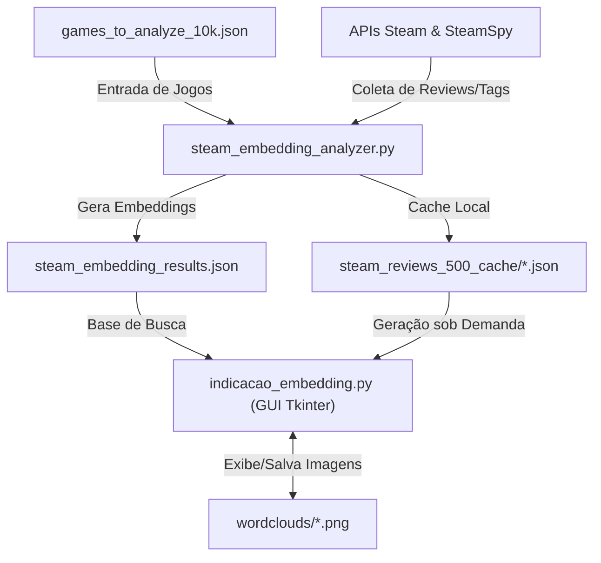

# 🎮 Steam Review and Recommendation — Recomendador Semântico de Jogos da Steam 

Sistema de recomendação semântica e busca vetorial em linguagem natural para jogos da plataforma Steam, desenvolvido como projeto da cadeira de Data Science.

O sistema utiliza o modelo de Inteligência Artificial **`BAAI/bge-small-en-v1.5`** (via *SentenceTransformers*) para gerar vetores de representação semântica (embeddings) a partir de até **500 análises (reviews) de usuários por jogo**, permitindo encontrar jogos com base em descrições livres em português ou inglês (ex: *"jogo de sobrevivência em mundo aberto com foco em construção e terror"*).

---

## 🌟 Funcionalidades

- 🔍 **Busca Vetorial por Linguagem Natural**: Procure jogos descrevendo dinâmicas, temas ou sentimentos desejados.
- 🌐 **Dicionário e Tradução Automática (PT ➔ EN)**: Suporte a busca em português com mapeamento semântico e fallback por similaridade de Levenshtein.
- 📐 **Similaridade por Cosseno em Espaço L2**: Cálculo exato de relevância vetorial entre a consulta e o perfil consolidado de análises do jogo.
- ☁️ **Nuvens de Palavras (WordClouds) On-the-Fly**: Visualização interativa das palavras mais frequentes em análises **Gerais**, **Positivas** ou **Negativas** para cada jogo recomendado.
- 🎨 **Interface Gráfica Steam Dark Mode**: UI desenvolvida em Tkinter inspirada no visual moderno da própria loja Steam.

---

## 🏗️ Arquitetura e Fluxo de Dados



---

## 📂 Estrutura de Arquivos Principais

| Arquivo / Pasta | Descrição |
| :--- | :--- |
| **`indicacao_embedding.py`** | Aplicação principal (GUI Tkinter + Motor de Recomendação Semântica). |
| **`steam_embedding_analyzer.py`** | Script backend para coleta de dados da Steam API e cálculo de vetores de embedding. |
| **`steam_embedding_results.json`** | Banco de dados consolidado com estatísticas, tags e vetores de embedding pré-calculados. |
| **`games_to_analyze_10k.json`** | Dataset com a lista dos 10.000 jogos analisados. |
| **`steam_reviews_500_cache/`** *(local)* | Pasta de cache local com análises brutas dos jogos para geração de Nuvens de Palavras. |
| **`wordclouds/`** *(local)* | Cache local de imagens `.png` das nuvens de palavras geradas. |

---

## 🚀 Como Executar o Projeto

### 1. Pré-requisitos e Instalação

Certifique-se de ter o Python 3.9+ instalado. Clone o repositório e instale as dependências:

sentence-transformers>=2.2.0
pillow>=9.0.0
nltk>=3.8
wordcloud>=1.9.0
requests>=2.28.0


### 2. Executando a Interface de Recomendação

Para abrir a interface gráfica e buscar jogos:

```bash
python indicacao_embedding.py
```

*Nota: Na primeira execução, o script baixará automaticamente os pesos do modelo levinho `BAAI/bge-small-en-v1.5` (~130MB).*

---

## 🔄 Re-gerando ou Atualizando o Banco de Dados (Opcional)

Se desejar re-coletar análises ou atualizar os vetores de embedding para novos jogos contidos no `games_to_analyze_10k.json`, execute:

```bash
python steam_embedding_analyzer.py
```

---

## 📄 Licença e Contexto

Este projeto foi desenvolvido como parte de Trabalho de Data Science em Mestrado de Informatica UFRJ.

Declaração de Uso de IA Generativa

Este projeto utilizou a ferramenta de inteligência artificial generativa Gemini (Google) como apoio técnico durante o desenvolvimento, nas seguintes atividades:

Apoio na documentação e organização do código-fonte.
Auxílio na depuração de erros e na melhoria da rastreabilidade por meio de logs de execução.
Suporte na implementação e ajustes da interface gráfica desenvolvida em Tkinter.

Nota: Toda a concepção da pesquisa, a definição da arquitetura do sistema de recomendação, o desenvolvimento da metodologia, o pré-processamento dos dados, a implementação da lógica do sistema, a análise dos resultados e a redação do trabalho foram realizados pelos autores. A ferramenta de IA foi utilizada apenas como apoio ao desenvolvimento e à documentação do software.
